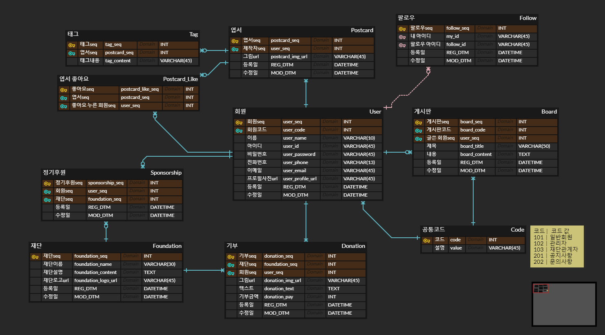
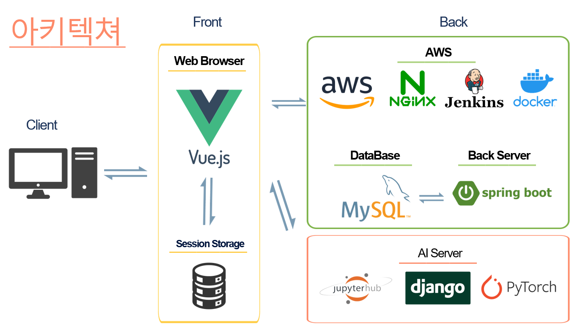
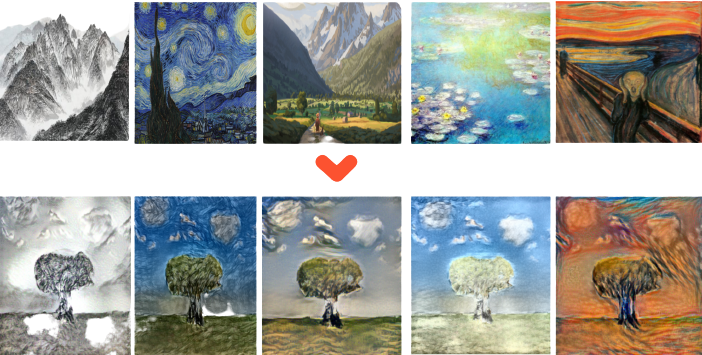
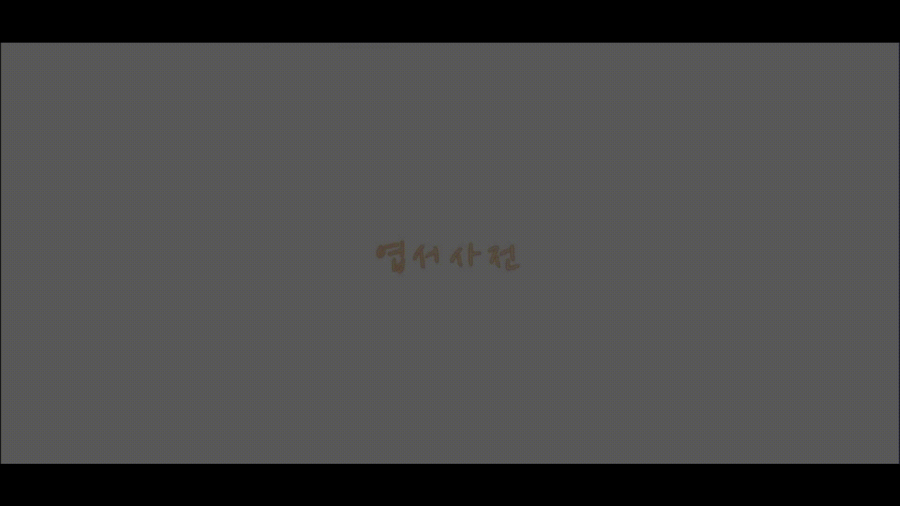
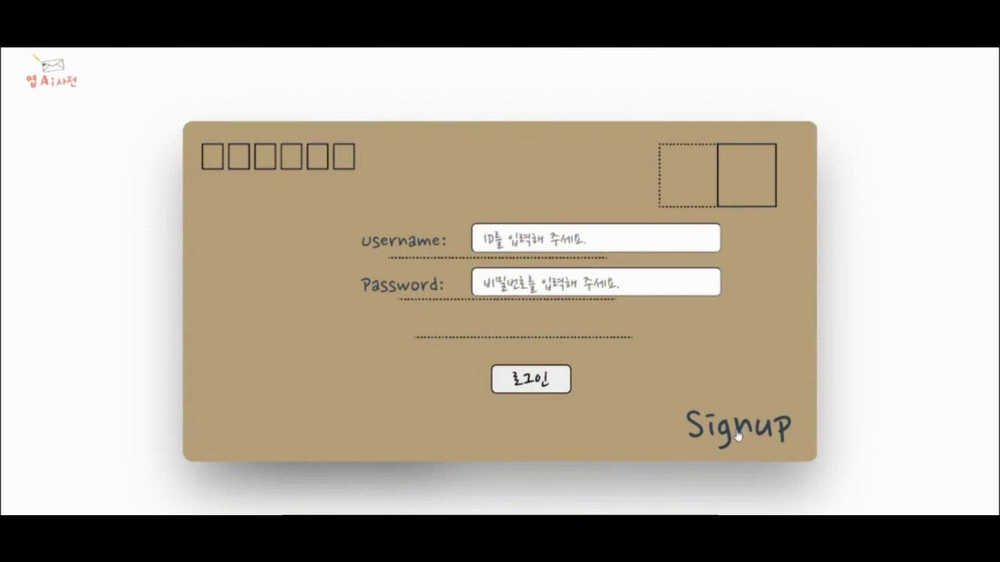
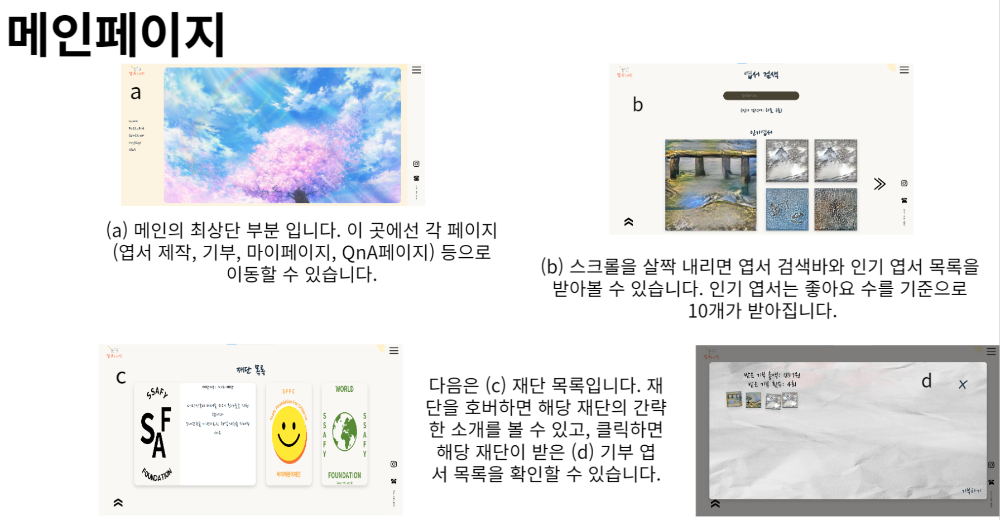
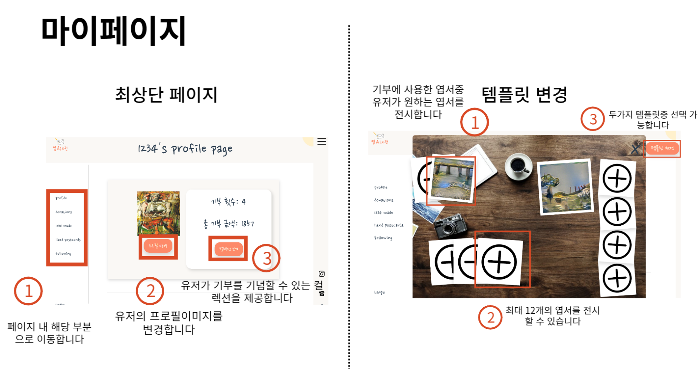
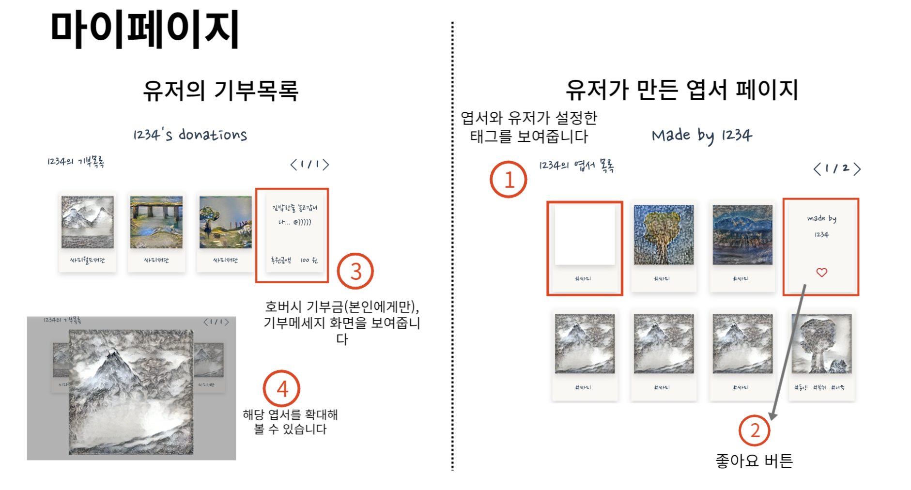
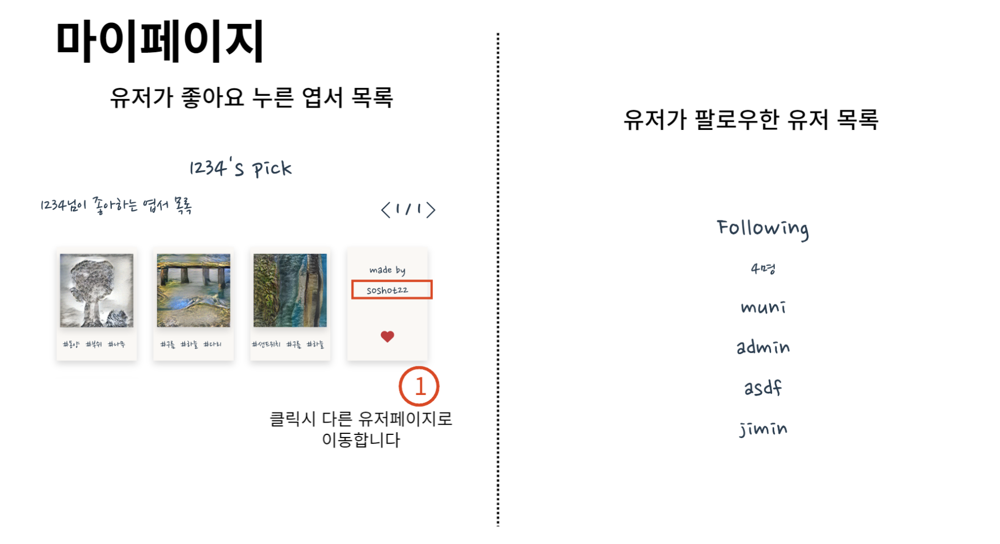
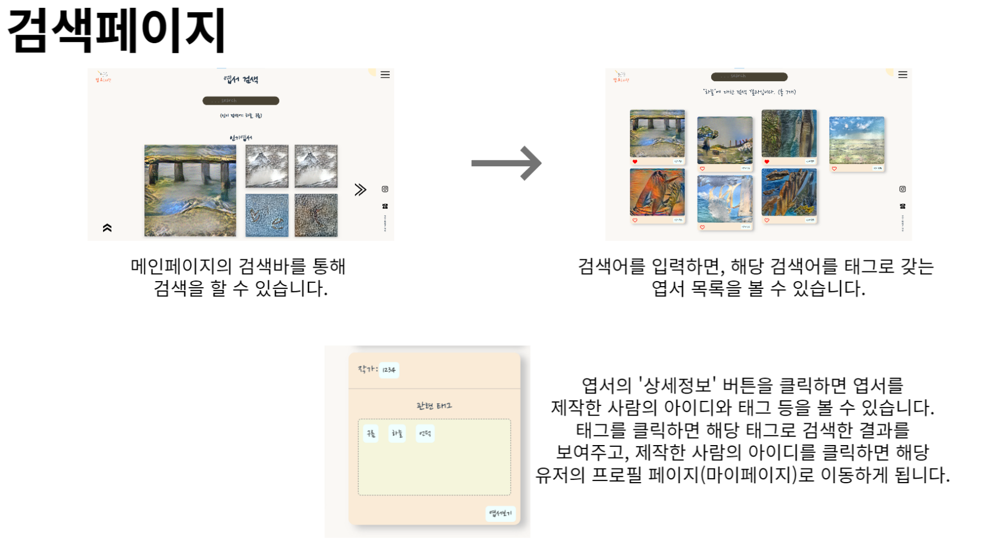

### 

---------------

### 목차

1. [엽AI사전 소개](#엽AI사전 소개)
2. [팀원 소개](#팀원 소개)
3. [사용 스택](#사용스택)
4. [기술 스택](#기술 스택)
5. [프로젝트 산출물](#프로젝트산출물)
6. [활용 기술](# 활용 기술)
7. [상세 기능](#상세기능)

## 엽AI사전 소개

엽AI사전 색다른 기부 문화 조성을 위해 시도한 실험적인 프로젝트입니다.

최근 중요 소비 트렌드인 가치소비에 착안하여 사용자가 직접 자신만의 엽서를 제작하고 해당 엽서와 함께 기부까지 함께 진행할 수 있는 웹서비스입니다.  

구체적으로 엽AI사전은 웹에서 사용자가 스케치한 그림을 AI(GauGan2)를 활용해 실사화를 진행한 후 AI(Neural Style Algorithm)를 통해 화풍을 입혀 DIY 엽서를 제공합니다. 이렇게 직접 제작한 엽서나 검색을 통해 발견한 마음에 드는 엽서는 원하는 기부단체에 기부 시 사용합니다. 그리고 기부를 한 후 기부에 사용한 엽서들은 본인의 템플릿을 꾸미는 데 사용할 수 있게 되어 더 많은 기부로 이어지도록 설계했습니다.

--------

SSAFY 7기 2학기 특화 프로젝트
 2022.08.22 ~ 2022.10.07 **(7주)**

## 팀원 소개

| 팀원  | 역할           | 담당                                                     | 깃헙                             |
| --- | ------------ | ------------------------------------------------------ | ------------------------------ |
| 박정현 | 팀장, Frontend | 메인페이지, 엽서 생성 기능, UCC 편집, 중간 발표                         | https://github.com/kevin123488 |
| 민경대 | Backend      | API 설계 및 개발, CI/CD환경 구축, AI(Neural Style Algorithm) 적용 |                                |
| 박제학 | Frontend     | 시작 화면, 마이페이지, 전체 화면 디자인                                | https://github.com/jehaak      |
| 손지민 | Backend      | API 설계 및 개발, CI/CD환경 구축, AI(GauGan2)적용                 |                                |
| 전현우 | Frontend     | 로그인/회원가입 로직, 기부 기능, 검색 페이지, UCC 기획, 최종 발표              | https://github.com/soshot22    |

## 기술 스택

펼쳐보기

 

## 프로젝트 산출물

- ERD

- 서비스 아키텍처

- 포팅매뉴얼

## 활용 기술

#### [GauGan2](http://gaugan.org/gaugan2/)

**사용 예시**

#### [Neural Style Algorithm](https://github.com/jcjohnson/neural-style)

## 상세 기능

#### 시작화면

#### 로그인/회원가입

#### 메인 화면

.png)

#### 엽서 생성

1. 웹에서 스케치를 진행

2. 스케치한 그림에 적용할 화풍을 선택하고 변환 작업을 거쳐 실사화를 얻은 후 검색에 사용할 태그를 추가 후 엽서 등록

#### 기부 페이지

#### 

